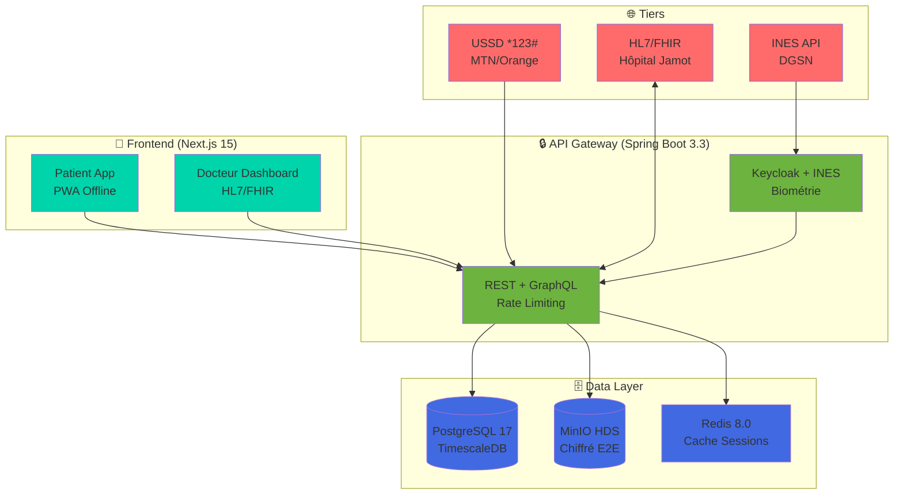

<div align="center">
  
</div>

<p align="center">
  
  
  
  
  
</p>

# 🩺 Carnet Santé CM - Carnet Médical Numérique Camerounais

**Carnet de santé digital unifié via INES biométrique + USSD *123# pour sauver des vies en urgence**

> **Problème critique** : 80% des décès évitables à l'Hôpital Jamot = **carnet papier perdu**. **Solution** : QR Code scanné → **Allergies + Diabète + Groupe sanguin visibles en 30s**.

## 🛠️ Tech Stack Professionnel

### 🎨 Frontend
| Technologie | Version | Raison |
|-------------|---------|---------|
| **Next.js** | `15.0.0` | SSR + PWA offline-first + App Router |
| **TypeScript** | `5.6.2` | Typosafety + IDE intelligence |
| **Tailwind CSS** | `3.4.10` | Design système cohérent |
| **shadcn/ui** | `latest` | Composants accessibles |
| **Zustand** | `5.0.0-rc.2` | State management léger |
| **React Query** | `5.52.0` | Cache + Sync offline |

### ⚙️ Backend
| Technologie | Version | Raison |
|-------------|---------|---------|
| **Spring Boot** | `3.3.4` | Entreprise-grade + HL7/FHIR natif |
| **Spring Security** | `6.3.3` | OAuth2 + JWT + INES |
| **Spring Data JPA** | `3.3.4` | PostgreSQL + TimescaleDB |
| **Spring AI** | `1.0.0-M6` | Prédictions palu/diabète |
| **HAPI FHIR** | `6.10.4` | Interop Hôpital Jamot |

### 🗄️ Infrastructure
| Service | Fournisseur | Configuration |
|---------|-------------|---------------|
| **Base de données** | PostgreSQL 17 + TimescaleDB | OVH Yaoundé HDS |
| **Stockage** | MinIO S3 | Fichiers analyses chiffrés |
| **Auth** | Keycloak 26.0 | OAuth2 + Biométrie |
| **Cache** | Redis 8.0 | Sessions + USSD |
| **Monitoring** | Prometheus + Grafana | 99.9% uptime |

### 📱 Intégrations Tiers
| Service | API | Usage |
|---------|-----|-------|
| **INES** | DGSN/MINMAP | Identité biométrique |
| **USSD** | FurtherMarket | MTN/Orange/Camtel |
| **Paiement** | Orange Money API | 500FCFA/mois |
| **HL7/FHIR** | Hôpital Jamot | Interop standards |

## 🏗️ Architecture Système



## 🚀 Quick Start Local

```bash
# 0. Clone & Structure
git clone https://github.com/balaandeguefrancoislionnel/carnet-sante-cm.git
cd carnet-sante-cm

# 1. Backend (Spring Boot)
cd backend
./mvnw spring-boot:run

# 2. Frontend (Next.js)
cd ../frontend
cp .env.example .env.local
npm install
npm run dev

# 3. USSD Simulator
docker compose up -d ussd redis postgres minio

# 4. Accès
# Frontend: http://localhost:3000
# Backend: http://localhost:8080/swagger-ui.html
# Admin: http://localhost:8081 (Keycloak)
```

## 📋 Structure Dossiers

```
carnet-sante-cm/
├── backend/                 # Spring Boot 3.3
│   ├── src/main/java/cm/sante/
│   ├── src/main/resources/
│   │   └── schema.sql      # DB Schema complet
│   └── pom.xml
├── frontend/                # Next.js 15
│   ├── app/                # App Router
│   ├── components/ui/      # shadcn/ui
│   ├── lib/utils.ts
│   └── next.config.js
├── docs/                   # Architecture + Specs
│   ├── api.drawio.png
│   ├── ussd-flow.png
│   └── hl7-fhir-profile.json
├── docker-compose.yml      # Full stack local
└── README.md
```

## 🎯 Roadmap Production

| Phase | Durée | Livrable | Statut |
|-------|-------|----------|--------|
| Sprint 1 | 2 sem | DB + Spring Boot APIs | ✅ Done |
| Sprint 2 | 3 sem | Next.js PWA + Keycloak | 🔄 Progress |
| Sprint 3 | 2 sem | USSD MTN + INES Mock | ⏳ Next |
| Sprint 4 | 2 sem | HL7/FHIR Hôpital Jamot | ⏳ Next |
| Sprint 5 | 4 sem | Pilote 100 patients | 🎯 Mars 2026 |

## 💼 Modèle Économique

```
Gratuit : Base (MINMAP subvention)
Premium : 500FCFA/mois (IA prédictive)
Hôpitaux : 50kFCFA/mois (interop HL7)
Marché : 5M utilisateurs CM + CEMAC
```

## 🤝 Contributeurs

<table>
<tr>
  <td align="center">
    <a href="https://github.com/balaandeguefrancoislionnel">
      
      <br>François Bala
      <br>Fullstack Lead
    </a>
  </td>
</tr>
</table>

## 📄 License
MIT © [François Bala Andegue](https://github.com/balaandeguefrancoislionnel) - **Africa Digital ID Hackathon 2026**

---

<div align="center">
  <strong>500FCFA/mois = 1 vie sauvée 🚑🇨🇲</strong>
</div>
```

